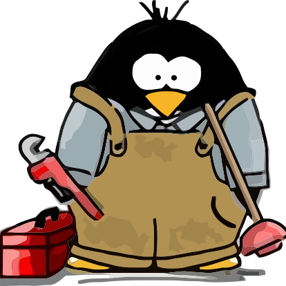
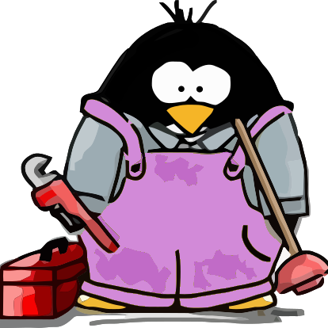

# Plumbers team

<table>
    <tr>
        <td></td>
        <td></td>
    </tr>
    <tr>
        <td></td>
        <td><a href="https://github.com/redhat-plumbers-in-action">@redhat-plumbers-in-action</a></td>
    </tr>
    <tr>
        <td></td>
        <td><a href="https://github.com/redhat-plumbers">@redhat-plumbers</a></td>
    </tr>
    <tr>
        <td></td>
        <td><a href="https://github.com/marketplace/actions/differential-shellcheck">@differential-shellcheck</a></td>
    </tr>
    <tr>
        <td></td>
        <td><a href="https://github.com/redhat-plumbers-in-action/advanced-issue-labeler">@advanced-issue-labeler</a></td>
    </tr>
    <tr>
        <td></td>
        <td><a href="https://github.com/redhat-plumbers-in-action/advanced-commit-linter">@advanced-commit-linter</a></td>
    </tr>
    <tr>
        <td></td>
        <td></td>
    </tr>
    <tr>
        <td></td>
        <td><a href="https://github.com/redhat-plumbers-in-action/devel-freezer">@devel-freezer</a></td>
    </tr>
</table>
